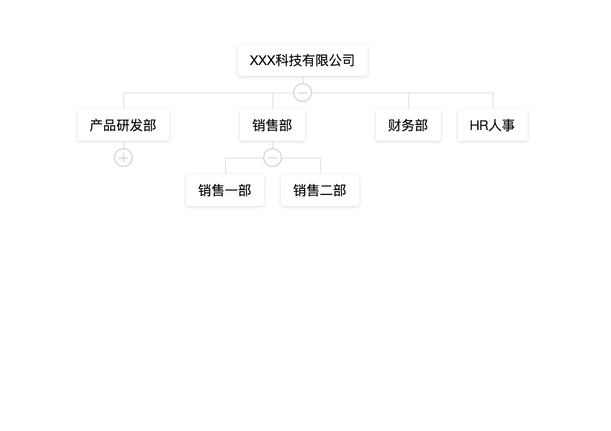
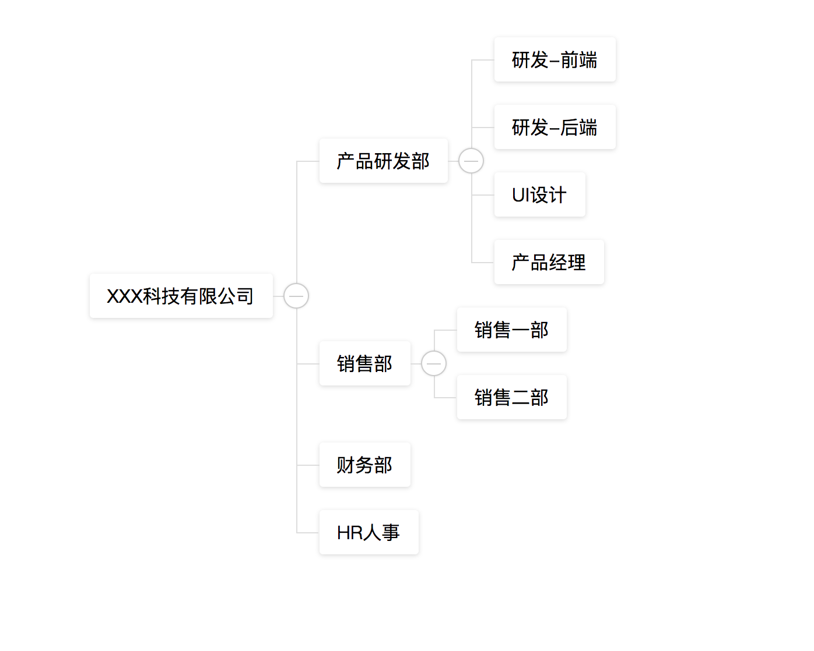

# org-tree

# Organization Tree Component
## Introduction
The organization tree component is a Vue 3 and Vue 2 implementation of an organization tree component (based on [vue-org-tree](https://github.com/hukaibaihu/vue-org-tree) for secondary rewriting). It can be used to display organization architectures, department structures, etc.


# Dependencies
- Vue 3 and Vue 2
- Vue-Demi

# Must
- Linux 
- yarn v4

# Test (Only one version of the component can be tested at a time)

```shell
# vue2
yarn build:vue2
yarn dev:vue2


# vue3
yarn build:vue3
yarn dev:vue3
```

# Legend



# Usage
```shell
# vue2 
npm install @liushuai05/org-tree@vue2
# vue3 
npm install @liushuai05/org-tree@vue3
```

# Contribution
The project and the author [hukaibaihu](https://github.com/hukaibaihu) of the project [vue-org-tree](https://github.com/hukaibaihu/vue-org-tree) only implemented the Vue 3 version. The Vue 2 version is compatible with horizontal architecture diagrams, and other features are not processed for the time being. 
Welcome to contribute to this project by submitting Pull Requests or opening Issues to improve it.

# Open Source License
MIT License

# Acknowledgements
Thanks to the author [hukaibaihu](https://github.com/hukaibaihu) of the project [vue-org-tree](https://github.com/hukaibaihu/vue-org-tree) for providing the inspiration and code.


